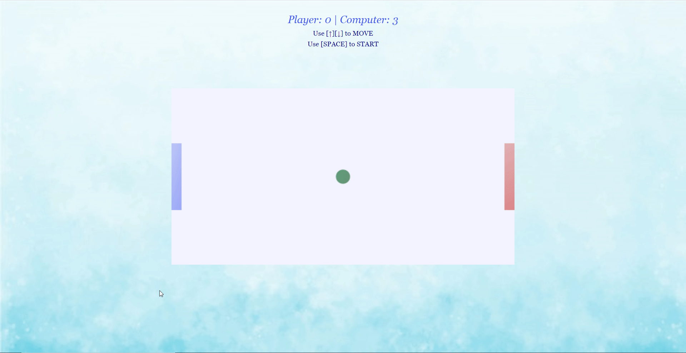

## Available Scripts

In the project directory, you can run:

### `npm start`

Runs the app in the development mode. 
Open [http://localhost:3000](http://localhost:3000) to view it in the browser.

The page will reload if you make edits. 

## Application Setup

The application was created with create-react-app and requires only npm install and npm start to get it installed and launched. App has to be run in production mode to see If service worker is working properly. App is live and working in this [link.](https://ozkanabdullahoglu.github.io/ping-pong/)

## User Guide

A simple ping pong game which created with canvas, you should score 5 to win against to computer AI.

## TODO

- Unit tests & Integration tests
- Redux If there will be any need with app-grow
- Styled components If there will be any need with app-grow
- Additional features
  - Sounds and related functinoalities such as mute sound
  - Give user ability on game style, such as pick background & paddle color & ball color
  - Fullscreen mode in supported browsers
